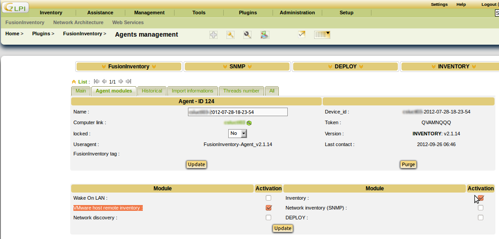
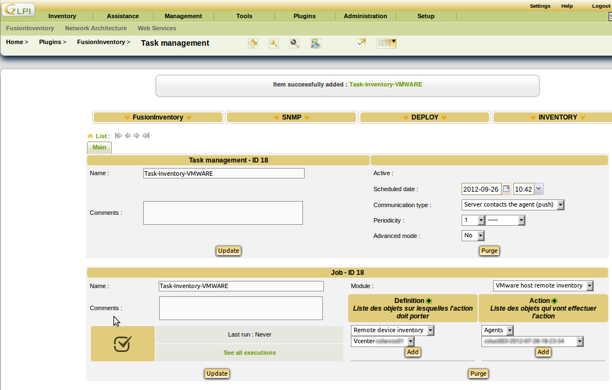

# Introduction

FusionInventory can contact a ESX/ESXi/vCenter serveur using the VMware SOAP API.
It will identify the ESX server and the associated virtual machine. At the
end, it will push XML inventory of the machines to the server:

1. the agent contact the server
    * the server answer with a list of VMware servers to scan and some credentials
2. the agent scan each VMware servers and generate the associated XML content
3. the agent send the XML to the server much like a local inventory

FusionInventory *DO NOT* use VMware Perl library.

[[!graph  src="""

    style=filled;
    color=lightgrey;
    node [shape=box, color=purple];
    size = "5, 5";

        subgraph cluster_0 {
                style=filled;
                color=lightgrey;
                node [style=filled,color=white];
    "vCenter1" -> "esx1" -> "vCenter1";
    "vCenter1" -> "esx2" -> "vCenter1";
    "vCenter1" -> "esx3" -> "vCenter1";
    "esx1" -> "vm1" -> "esx1";
    "esx2" -> "vm2" -> "esx2";
    "esx2" -> "vm3" -> "esx2";
    "esx3" -> "vm4" -> "esx3";
    "esx3" -> "vm5" -> "esx3";
    "esx4" -> "vm6" -> "esx4";
                label = "VMware API";
        }

    "Serveur" -> "Agent" -> "Serveur";
    "Agent" -> "vCenter1" -> "Agent";
    "Agent" -> "esx4" -> "Agent";

"""]]

# Installation
To inventory ESX or Vcenter, there is no specific agent to be installed on the ESX. The Fusioninventory agent installed on Windows or Linux, will inventory remotely by a automatic task.
For Windows host, the Fusioninventory Agent comes with the module. For Linux distribution, you must install a additional package.

On Redhat/Centos, run 

    # yum install perl-FusionInventory-Agent-Task-ESX

On Debian/Ubuntu :

    # apt-get install libfusioninventory-agent-task-esx-perl

From Source, see the [agent source installation page](/documentation/documentation/agent/installation/source.html).

# From the Command line

You can use [fusioninventory-esx](/documentation/documentation/references.html) and [fusioninventory-injector](/documentation/documentation/references.html) to:

1. fetch the Inventories from the server
2. push the Inventories in GLPI

For example:

    # fusioninventory-esx --user root --password password --host esx-server --directory /tmp
    # fusioninventory-injector -v --file /tmp/esx-server-2011-01-25-14-11-07.ocs -u https://myserver/plugins/fusioninventory/

# From GLPI

##  Reconfiguration FusionInventory agent

First, we must designate the fusion agents who will have to perform the inventory VMware (ESX or VCenter) host.

Go to Plugins → Home → FusionInventory → Agents management

Chose a agent and enable : VMware host remote inventory :

[[!template  id=warning text="Since some account credentials will be send by the agent,
we strongly recommend the user of a known machine with SSL enabled."]]

## Task management

### Add authentication for remote devices (VMware)

Add an authentification : 

Go to Plugins  → FusionInventory → Authentication for remote devices (VMware)

[[!template  id=warning text="We strongly recommend the user of account with limited privilege."]]

### Add remote devices to inventory (VMware)

Goto  Plugins → FusionInventory → Remote devices to inventory (VMware)

Click on + to add a device 

* Name : Add a description
* Type : "chose VMWARE Host"
* Add an Authentication
* IP : add an ip address

### Add a task 

Please see the [task creation](/documentation/documentation/fi4g/tasks.html) page.

Click on + to add a task :

* Configure the periodicity
* Chose Module : VMware host remote inventory
* Add Definition → Remote device inventory
* Select the agent earlier reconfigured 

