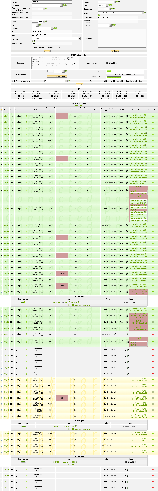
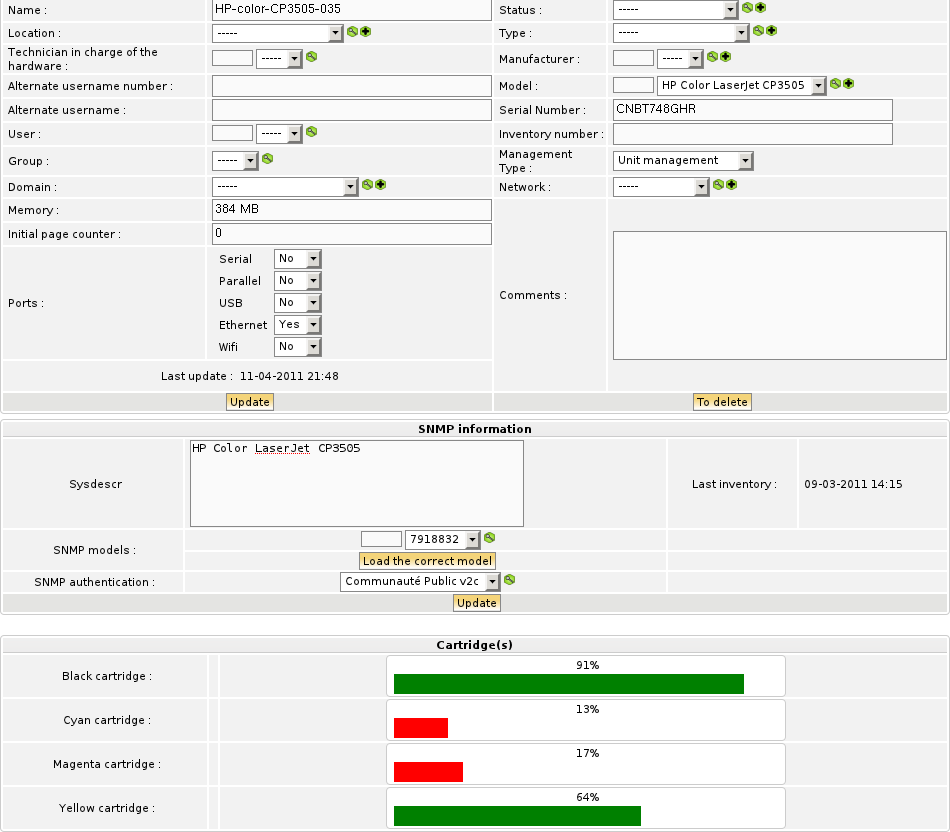
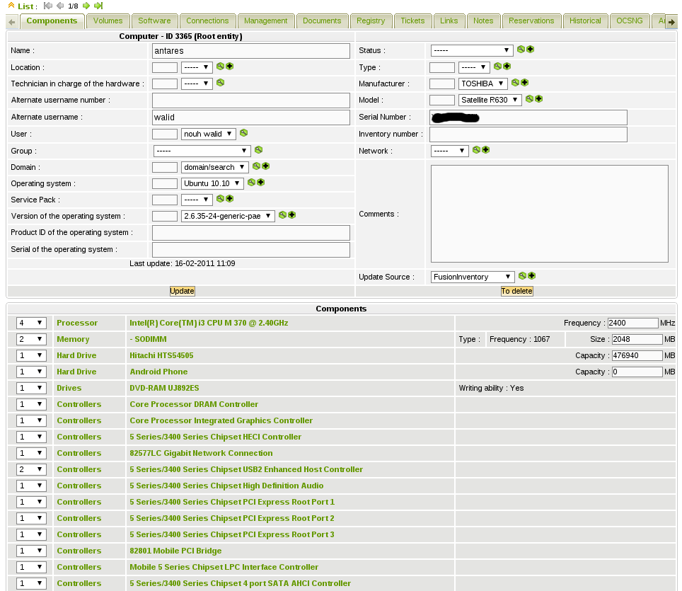
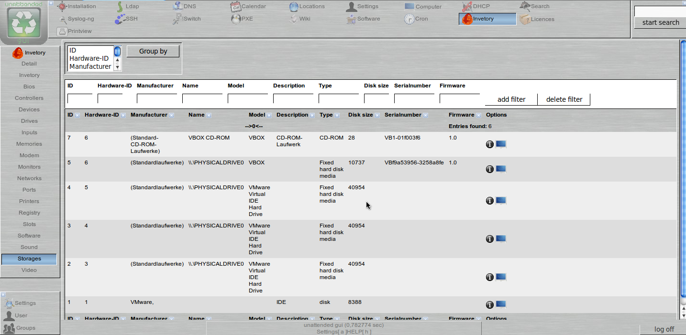
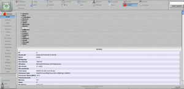
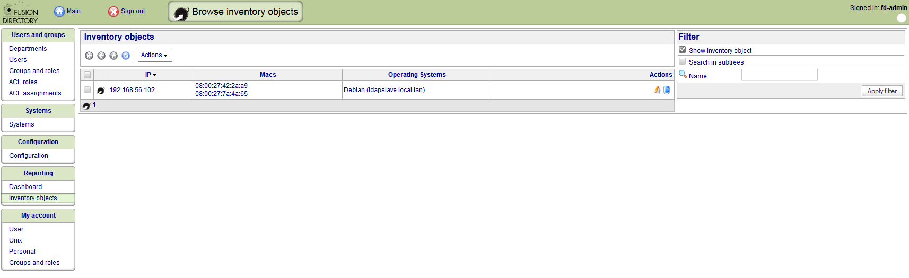
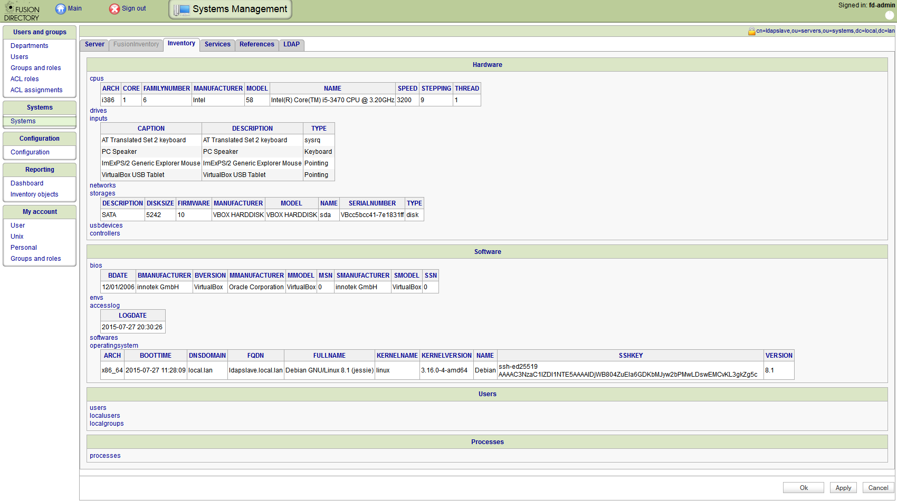

## FusionInventory for GLPI

   

   

   

## FusionInventory Agent

   

   

   

   

## Uranos

[Uranos](http://uranos.sourceforge.net/www/index.php?loadsub=quwiki&func=wiki&type=index) is another
server that support FusionInventory Agent.

   

   

# FusionDirectory

[FusionDirectory](https://www.fusiondirectory.org/) is an infrastructure manager that support FusionInventory

 

